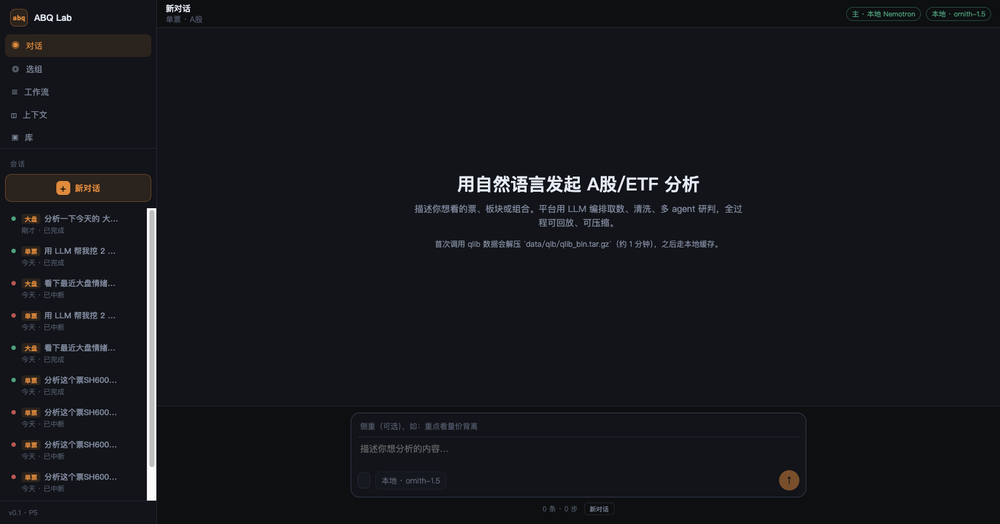
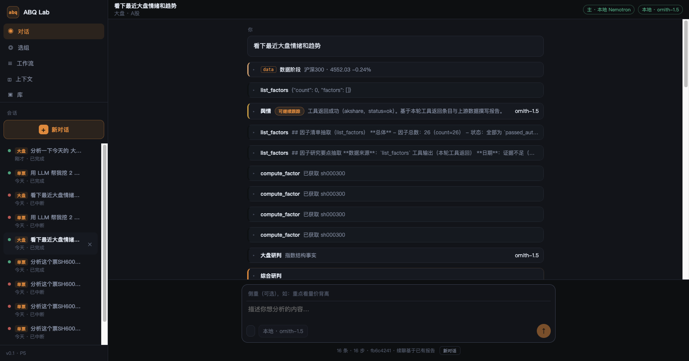
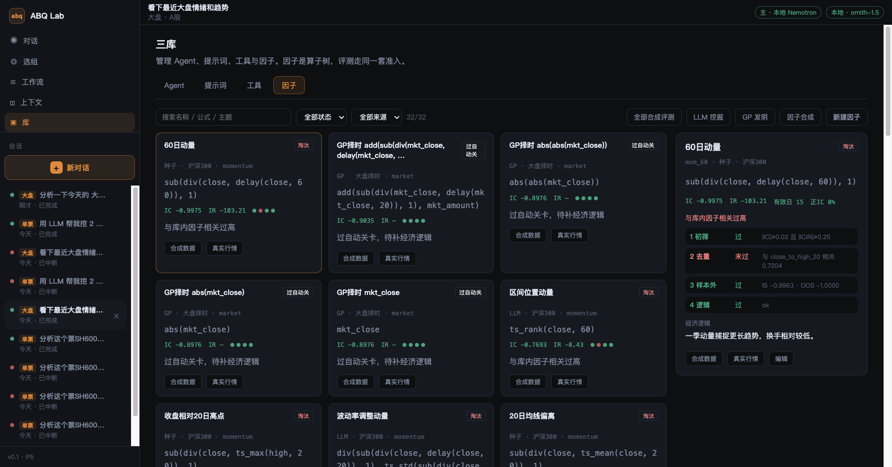
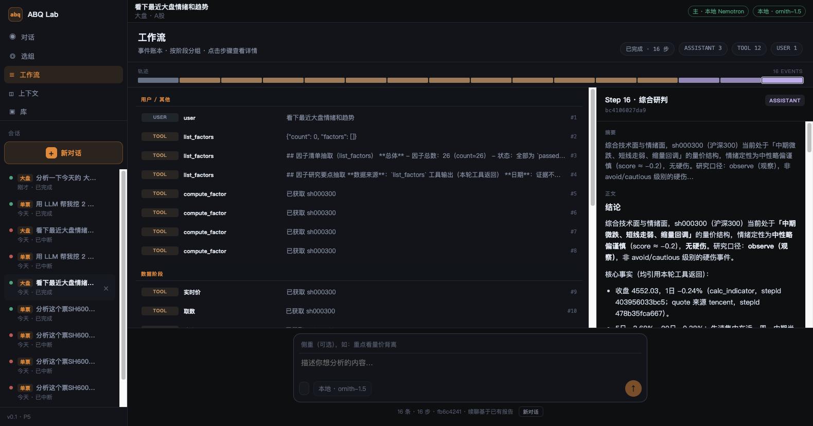
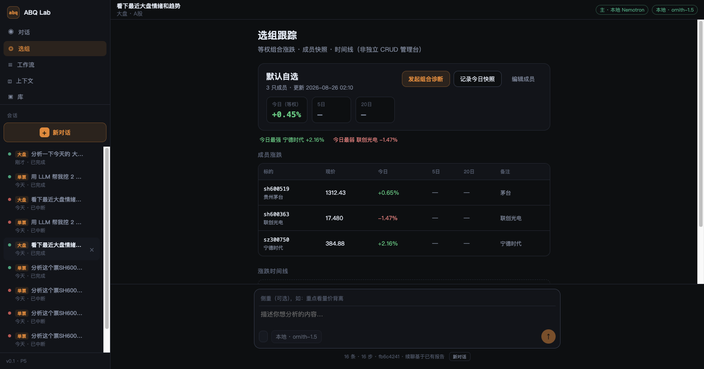

# ABQ Lab 使用说明

> 面向日常使用者的操作指南。设计细节见 [DESIGN.md](./DESIGN.md)。
>
> **一句话定位：对话即控制台。** 库 / 选组 / 工作流页只是「查看器」——
> 凡是 USER_GUIDE 列出的能力，都应能通过一句中文在对话里完成，无需先去别处点按钮。
> 完整话术清单见 [NL_SCENARIOS.md](./NL_SCENARIOS.md)。

---

## 1. 快速开始

### 1.1 启动服务

**后端**（端口 **8000**）：

```bash
cd backend
python3 -m venv .venv
source .venv/bin/activate
pip install -e .
cp ../.env.example ../.env   # 可选：配置 API Key
uvicorn app.main:app --reload --port 8000
```

**前端**（端口 **5173**）：

```bash
cd frontend
npm install
npm run dev
```

浏览器打开 **http://127.0.0.1:5173**。

> **开发注意**：
> - 前端通过 Vite 将 `/api` 代理到 `http://127.0.0.1:8000`（见 `frontend/vite.config.ts`）。若后端改端口，需同步修改代理 `target`，否则页面会出现 **502**。
> - 前端 **只绑 5173**（`strictPort: true`）。若端口被占用，`npm run dev` 会失败而不是跳到 5174。
> - 后端须在**本机终端**启动。用 Cursor Agent 沙箱代起 uvicorn 时，访问远端 LLM 会被拦（页面里出现 `Blocked by sandbox network policy` / `118.195.177.58:8001`）。

> 首次分析会解压 `data/qib/qlib_bin.tar.gz`（约 1 分钟），之后走本地缓存。

### 1.2 界面总览



左侧是全局导航与会话列表，主区域根据当前页面切换内容，底部输入框三页共用。侧栏品牌为 **ABQ//Lab**（`//` 是终端风分隔符，不是路径或注释）；顶栏有会话标题、分析 kind、LIVE/快照与时钟。

单票 / 组合分析进行中可展开右侧摘要：行情 Quote 板（OHLC、量、as-of）与三视角结论。选组页成员以涨跌色块扫一眼，明细仍用表格。库 → 知识库 → 图谱为力导向视口（角上 HUD）。

| 导航项 | 用途 |
|---|---|
| **对话** | 发起分析、查看结论、续聊追问（控制台） |
| **选组** | 跟踪自选组合涨跌、记录快照（查看器） |
| **工作流** | 回放某次分析的完整步骤（查看器） |
| **上下文** | 查看模型实际吃到的 token 与压缩情况（查看器） |
| **库** | 管理 Agent、提示词、工具、因子、选股、知识库（查看器） |

---

## 2. 发起分析（对话页）

### 2.1 基本操作

1. 点击侧栏 **「新对话」**
2. 在底部输入框描述你想分析的内容
3. （可选）在上方「侧重」框填写关注点，如「重点看量价背离」
4. 点击发送 ↑，等待流式步骤出现

平台会自动识别分析类型并在顶栏显示标签，例如 **单票 · A股**、**大盘 · A股**、**选组 · A股**。

### 2.2 单票分析

**示例提问**：

```
看 600519，最近量价如何
```

```
分析 SH600363 联创光电，注意看半年行情
```

**流程**：取数 → 清洗 → 指标 → 技术/基本面/舆情（并行）→ 综合研判。

分析过程中，对话流会逐步出现折叠的步骤卡片。数据阶段的多步取数会合并为一张「取数」卡片。完成后可展开 **综合研判** 阅读完整报告。

**续聊**：在同一会话底部继续提问，默认只跑 judge 综合已有报告；需要全量重跑可在请求中加 `force_full: true`（API 层）。

### 2.3 大盘研判

**示例提问**：

```
看下最近大盘情绪和趋势
```

```
分析一下今天的大盘趋势，侧重新能源
```

**流程**：指数行情 + 板块宽度 + 板块脉冲 → 择时因子 → 大盘研判 / 舆情 → 综合研判。

「侧重」框或消息中的板块关键词会注入 `theme_hint`，影响板块脉冲匹配。



### 2.4 选组诊断

**方式一：对话直接提问**

```
对比 600519 和 600363 的强弱
```

```
帮我看下自选组合的配置风险
```

**方式二：选组页发起**

见 [§4 选组跟踪](#4-选组跟踪)。

**流程**：批量拉取成员行情 → 因子截面 → 组合诊断 agent → 综合研判。

### 2.5 因子挖掘（无需股票代码）

**示例提问**：

```
用 LLM 帮我挖 2 个动量因子
```

```
用 GP 发明一个大盘择时因子
```

编排层会直接启动后台挖掘任务（无需 supervisor）。对话顶部会出现 **FactorMineBanner** 进度条，显示漏斗各阶段状态。



挖掘完成后，新因子出现在 **库 → 因子** Tab，可查看闸门详情与 IC 指标。

### 2.6 一句话完成复合任务（NL 控制台）

下列话术在对话里直接说即可，编排层会自动拆成多步链路，无需手动跳页：

| 话术 | 平台动作 |
|------|---------|
| `用因子从沪深300选出 20 只股票` | 跑截面选股，对话内出 **Top N 表** 卡片（`ScreenActionCard`）；编排层确定性，无需 LLM |
| `从沪深300选出 20 只，放进默认自选并诊断` | 选股 → 导入默认组合 → 自动跑组合诊断（`composite_screen`） |
| `中证500选出 10 只替换进默认自选` | 选股 → **替换**默认组合成员（不诊断） |
| `帮我诊断一下默认自选` | `kind=portfolio` 组合诊断 |
| `列出我的自选组合` | 调 `list_portfolios`，对话里列出组合与成员 |
| `有哪些动量因子` / `列出因子` | 编排层直接列出因子库（可带主题：动量/反转/波动…），含 IC/ICIR |
| `用 LLM 帮我挖 2 个动量因子` / `用 GP 发明大盘择时因子` | 编排层直接启动 LLM/GP 挖掘，顶部 **FactorMineBanner** 显示进度 |
| `把这段监管条文入库` + 粘贴正文 | 编排层直接 `ingest_policy_text` 写入知识库（可带标题/《书名》） |
| `检索政策：减持新规` / `搜索舆情：茅台中报` | 编排层直接 `search_knowledge` 检索知识库 |
| `取消当前分析` | 编排层直接 `cancel_analysis`；分析卡顿时也可点 **停止** 按钮 |
| `上次怎么看茅台` | 触发 `memory_intent`，对话顶部出现 **记忆横幅** 并注入历史研判 |

**选股卡片**：选股完成后对话里会出现一张可操作卡片——
顶部是 Top N 表，底部有 **「导入选组」** 与 **「发起组合诊断」** 按钮，点击即把结果落进自选或继续诊断。

**工具失败时的建议动作**：当某个工具调用失败（如组合不存在），步骤卡片会附带
`suggested_action` 提示下一步该说什么，例如「先调用 list_portfolios」。按提示继续即可。

### 2.7 知识库：入库与检索（无需股票代码）

**政策入库** — 在消息里粘贴正文：

```
把这段监管条文入库：
标题：信息披露监管要求
内容：
第一条 上市公司应及时披露重大事项。
第二条 …
```

也可用《文件标题》包裹标题，正文换行粘贴。编排层直接切块、向量化（需 `EMBEDDING_ENABLED=true`）。

**知识检索**：

```
检索政策：减持新规
搜索舆情：茅台中报
```

命中结果以表格形式出现在对话步骤卡；无命中时会提示先入库或等待舆情归档。

分析卡顿时可说 **「取消当前分析」**（编排层会取消其他进行中的流；同会话亦可点 **停止**）。

---

## 3. 工作流回放

完成一次分析后，点击侧栏 **「工作流」** 查看该会话的完整步骤账本。



- **顶部色块时间线**：按阶段概览（数据 / 工具 / agent）
- **左侧步骤列表**：点击任意步骤查看详情
- **右侧详情面板**：展示该步的完整正文与元数据

适合排查「某步工具返回了什么」「哪个 agent 用了 local 模型」等问题。

---

## 4. 选组跟踪

点击侧栏 **「选组」** 进入组合跟踪页。



### 4.1 页面功能

| 区域 | 说明 |
|---|---|
| **等权概览** | 今日 / 5 日 / 20 日等权涨跌；最强 / 最弱成员 |
| **成员涨跌表** | 各成员现价、涨跌幅、备注 |
| **涨跌时间线** | 历史快照记录（需手动或诊断后写入） |

### 4.2 常用操作

| 按钮 | 作用 |
|---|---|
| **发起组合诊断** | 跳转到对话流，以 `kind=portfolio` 跑完整组合分析 |
| **记录今日快照** | 将当前等权涨跌写入时间线 |
| **编辑成员** | 修改组合成员列表（6 位代码，每行一只） |

默认组合 `default` 含三只种子股（成员存于 `data/portfolios/default/meta.json`）。成员也可在诊断消息中直接列出代码。

### 4.3 多组合管理（P5.1）

选组页左侧 **「我的组合」** 列表支持新建（+）、切换、删除（`default` 不可删）。

### 4.4 组合摘要侧栏

对话页完成 **组合诊断** 后，右侧会出现 **组合摘要** 侧栏，展示等权涨跌、成员列表、组合诊断与综合研判（与单票摘要对称）。

---

## 5. 上下文页

选中一条已有会话后，点击 **「上下文」** 可查看：

- **持久化全量 token** vs **模型可见 token** 对比
- 压缩率与关键发现条数
- 压缩事件时间线（续聊超阈值时触发）
- 各 agent 关键发现卡片

用于理解「模型实际看到了什么」以及长会话是否已压缩。

---

## 6. 库管理

点击 **「库」** 进入管理页。共 **六个 Tab**：

| Tab | 可做什么 |
|---|---|
| **Agent** | 查看 / 新建 / 编辑子 agent（人设、工具列表、模型 tier） |
| **提示词** | 管理 instructions 模板；内置种子不可删除 |
| **工具** | 只读目录，查看已注册工具及说明 |
| **因子** | 浏览因子库、评测、LLM 挖掘、GP 发明、因子合成、纸面重评 |
| **选股** | 界面化跑截面因子选股（与对话 `用因子从沪深300选出…` 等价） |
| **知识库** | 浏览归档舆情 / 大盘宽度事件、上传政策文档、检索记忆；对话亦可 `入库` / `检索政策：…` |

### 6.2 因子库常用操作

1. **筛选**：按状态 / 来源 / 主题过滤
2. **点卡片**：查看五道闸门详情、**IC 时序曲线**、经济逻辑
3. **纸面重评**：工具栏按钮，对 `paper_tracking` / `frozen` 因子批量重跑评测并应用 Gate 5 规则
4. **LLM 挖掘**：填写主题与数量，后台跑提议→评测循环（对话可说「用 LLM 帮我挖 2 个动量因子」）
5. **GP 发明**：选择轨 A（大盘择时）或轨 B（截面选股）
6. **因子合成**：将多个因子按 equal / ic / ic_ir 权重合成

### 6.3 知识库常用操作

1. **Tab 浏览**：舆情归档、大盘宽度事件、已入库政策文档列表、**图谱探索**（力导向子图）
2. **上传**：支持 PDF / TXT / MD（库页上传；对话粘贴见 [§2.7](#27-知识库入库与检索无需股票代码)）
3. **检索**：库页搜索框，或对话 `检索政策：关键词` / `搜索舆情：关键词`
4. **跨会话记忆**：对话「上次怎么看茅台」触发记忆横幅（与向量检索互补）

### 6.4 知识图谱（库 → 知识 · **图谱** Tab）

默认 **增量更新**：6h 内不重复爬取；归档与月摘要在数据未变时自动跳过；图谱边按 `(源, 类型, 目标)` 去重。

| 操作 | 说明 |
|---|---|
| **增量更新** | 同步当前股 + 市场层 + 政策增量 + 本月摘要（推荐） |
| 强制全量刷新 | 高级选项中，忽略冷却与摘要去重 |
| 政策 URL | 高级选项中，白名单官网单条入库 |

API：`POST /api/graph/sync/incremental?symbol=sh600519`

---

## 7. 会话管理

### 7.1 侧栏会话列表

- 每条会话显示 **类型标签**（单票 / 大盘 / 选组）和状态（进行中 / 已完成 / 已中断）
- 点击切换会话；悬停显示删除按钮
- **新对话** 会自动取消其他进行中的分析，避免并行冲突

### 7.2 停止与删除

- 分析进行中时，composer 区域可停止（调用 `POST /api/analyze/cancel/{id}`）
- 删除 running 会话需 `DELETE /api/paths/{id}?force=true`

---

## 8. 模型与配置

### 8.1 双模型分层

| Tier | 用途 | 配置 |
|---|---|---|
| **primary** | 子 agent 推理、综合研判 | `.env` 中 `PRIMARY_*` |
| **local** | 长输出 extract、上下文压缩 | `.env` 中 `LOCAL_*` |

composer 底部可选择本次分析的 primary 模型；顶栏显示当前 LLM 就绪状态，分析进行中为 **LIVE**，空闲为 **快照**。

### 8.2 环境变量（`.env` 示例）

> 变量名以 `.env.example` 为准；密钥只放环境变量，前端不落盘。

```bash
# Primary（子 agent 推理、综合研判）
PRIMARY_LLM_BASE_URL=https://api.deepseek.com/v1
PRIMARY_LLM_API_KEY=sk-...
PRIMARY_LLM_MODEL=deepseek-chat
PRIMARY_LLM_PROVIDER_ID=deepseek
PRIMARY_LLM_LABEL=DeepSeek

# Local（长输出 extract、上下文压缩；OpenAI 兼容自部署）
LOCAL_LLM_BASE_URL=http://127.0.0.1:8001/v1
LOCAL_LLM_API_KEY=
LOCAL_LLM_MODEL=nemotron

# 数据 / RAG / 图谱
OHLCV_BACKFILL_ENABLED=true
EMBEDDING_ENABLED=true
RERANKER_ENABLED=true
KNOWLEDGE_ARCHIVE_ENABLED=true
GRAPH_ENABLED=true
GRAPH_SYNC_SAMPLE_SYMBOLS=sh600519,sh601318,sz000858,sh600036,sz300750
GRAPH_EXTRACT_TRIPLES_ENABLED=true
GRAPH_SCHEDULER_ON_STARTUP=false
POLICY_SYNC_MAX_PER_RUN=5

# 上下文压缩触发阈值（token 估算，默认 128k）
CONTEXT_COMPACT_THRESHOLD_TOKENS=128000
```

**图谱 CLI**（`pip install -e .` 后可用）：

```bash
abq-graph sync-market      # 北向/两融/宏观/大盘快照
abq-graph policy-sync      # 证监会等政策列表增量入库
abq-graph maintenance      # jsonl gzip + 月 Rollup + 政策同步
```

### 8.3 开发与 CI

本地质量检查：

```bash
# 后端：单元测试 + ruff（与 CI 一致）
cd backend && python -m pytest tests -q
ruff check app

# 前端：类型检查 + 生产构建
cd frontend && npm run build
```

GitHub Actions（`.github/workflows/ci.yml`）在 push/PR 时跑：**backend pytest**、**ruff check app**（阻断）、**frontend build**。

---

## 9. 常见问题

### Q：提示「未能从消息中识别股票代码」

单票分析需要在消息中包含 6 位 A 股代码（如 `600519`）。因子挖掘、大盘分析、因子选股不需要代码。

### Q：分析很慢或卡住

- 检查后端终端是否有报错
- 首次取数需解压 qlib，属正常
- 本地模型未启动时，extract / 压缩可能失败并回退规则摘要

### Q：行情与因子日期不一致

本地 qlib 末日可能落后当天，系统自动用 baostock 补洞。实时价是最新的，但部分因子 `as_of` 可能滞后数日——综合研判会在「未决」中标注。

### Q：续聊为什么只更新综合研判

默认续聊策略是 judge-only，节省 token 与时间。需要重跑三视角时，使用 API 的 `force_full: true`。

### Q：页面打开了，但会话列表失败 / 分析报 sandbox network policy

- 全部 API **502** 或 `ECONNREFUSED 127.0.0.1:8000`：后端没开，在本机终端起 `uvicorn … --port 8000`。
- 分析步骤出现 `Blocked by sandbox network policy` / `Destination: 118.195.177.58:8001`：当前 uvicorn 跑在受限沙箱里，出站 LLM 被拦。停掉该进程，在普通终端重起后端。
- 前端跑在 **5174**：旧 Vite 占着 5173。关掉占用后只开 `http://127.0.0.1:5173`（配置了 `strictPort`，不会再自动跳端口）。

### Q：页面上的双斜线 `//` 是什么

设计元素。侧栏 `ABQ//Lab`、顶栏 `ABQ//` 对齐盯盘终端的品牌句式，不是文件路径或代码注释。

### Q：如何新增自选成员

- 对话里说 `从沪深300选出 20 只，放进默认自选`（推荐，NL 控制台）
- 选组页点 **「编辑成员」**
- 组合元数据存于 `data/portfolios/default/meta.json`，编辑后刷新页面

---

## 10. 推荐工作流

```
日常看盘
  └─ 对话：「看下大盘情绪」→ 读综合研判

个股研究
  └─ 对话：「看 600519 量价」→ 工作流核对取数 → 续聊追问

自选跟踪
  └─ 对话：「从沪深300选出 20 只，放进默认自选并诊断」→ 选组页看涨跌 → 每周「记录今日快照」

因子研究
  └─ 对话：「挖 2 个动量因子」→ FactorMineBanner → 库页查看闸门 → 通过后用于分析挂载

知识库
  └─ 对话：「把这段监管条文入库」+ 正文 → 「检索政策：减持新规」核对命中

跨会话记忆
  └─ 对话：「上次怎么看茅台」→ 顶部记忆横幅 → 续聊追问复用历史研判
```

---

## 附录：截图索引

| 文件 | 内容 |
|---|---|
| `images/01-chat-home.png` | 对话空态首页 |
| `images/02-portfolio.png` | 选组跟踪页 |
| `images/03-chat-market.png` | 大盘分析对话流 |
| `images/04-workflow.png` | 工作流回放 |
| `images/05-library.png` | 因子库 |

截图可能早于 2026-08-27 壳层质感（`ABQ//Lab`、时钟、Quote 板）。以当前页面为准。
